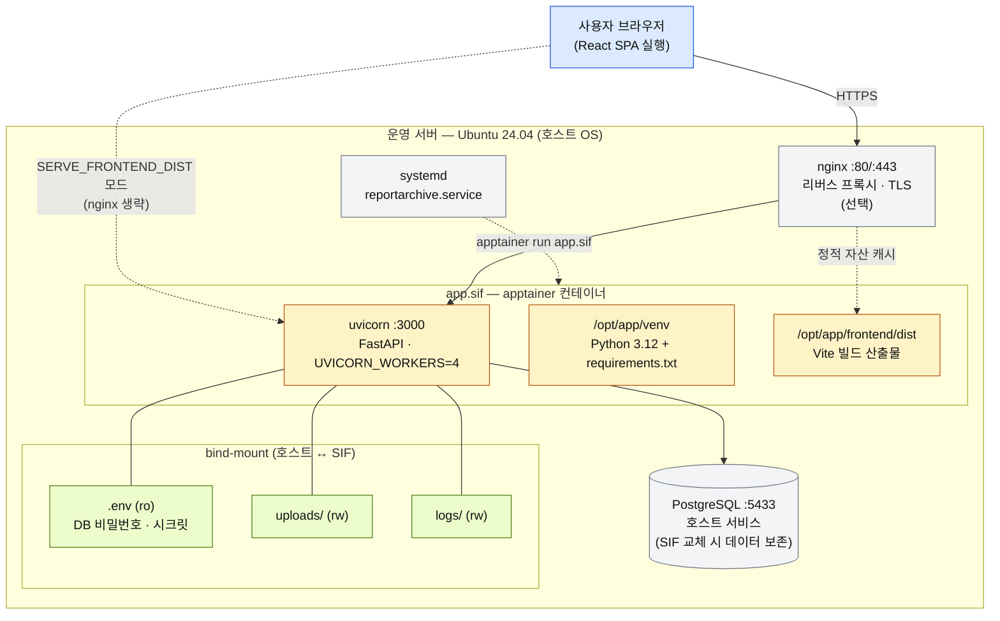
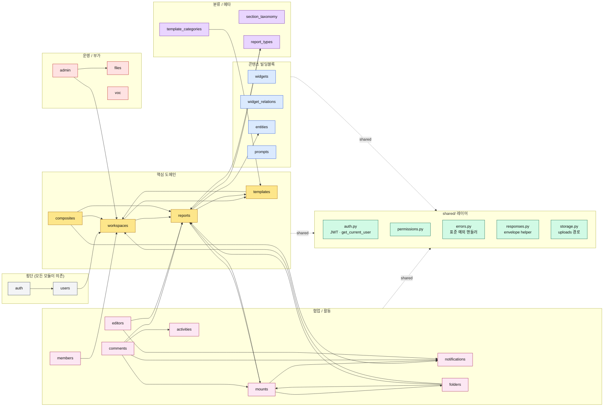
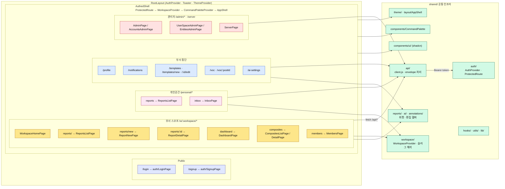

# 시스템 아키텍처

ReportArchive를 네 가지 관점에서 본 다이어그램. GitHub/대부분의 마크다운 뷰어에서
Mermaid가 자동 렌더링된다. 텍스트로 수정 가능하니 구조가 바뀌면 같이 갱신할 것.

- **1. 배포 토폴로지** — 운영 서버에서 무엇이 어디에 떠 있는가
- **2. 런타임 / 요청 흐름** — 요청 하나가 통과하는 레이어
- **3. 백엔드 모듈 맵** — 22개 모듈의 그룹과 의존 관계
- **4. 프론트엔드 모듈 맵** — 라우트 / modules / shared 의 결합

세부 배포 결정의 *이유* 는 `배포구조.md`, 도메인 설계 합의는 `협업개선_설계.md`
참조.

---

## 1. 배포 토폴로지

운영 환경: Ubuntu 24.04 호스트 + apptainer SIF 단일 번들 + 호스트 PostgreSQL.



핵심 분리선:
- **SIF 안**: OS 베이스(ubuntu:24.04) · Python 3.12 · 백엔드 의존성 · 빌드된 프론트 dist
- **호스트**: apptainer · PostgreSQL · systemd · (선택) nginx
- **bind-mount**: .env · uploads · logs — SIF 교체 시 살아남아야 하는 것들

---

## 2. 런타임 / 요청 흐름

`/api/*` 요청 하나가 어떤 레이어를 통과하는가. 표준 envelope
`{ success, data, message, errors }` 로 응답.

```mermaid
sequenceDiagram
  autonumber
  participant U as 사용자
  participant S as React SPA<br/>(shared/api/client.js)
  participant N as nginx
  participant F as FastAPI app<br/>(main.py)
  participant MW as CORS / 예외 핸들러<br/>(shared/errors.py)
  participant R as APIRouter<br/>modules/&lt;name&gt;/routes.py
  participant A as 인증 의존성<br/>(shared/auth.py)
  participant SVC as services.py
  participant ORM as SQLAlchemy<br/>models.py
  participant DB as PostgreSQL

  U->>S: 페이지/액션 클릭
  S->>N: fetch /api/...
  N->>F: proxy_pass
  F->>MW: 미들웨어 통과
  MW->>R: route 매칭
  R->>A: get_current_user 등
  A-->>R: User
  R->>SVC: 도메인 함수 호출
  SVC->>ORM: 쿼리/커밋
  ORM->>DB: SQL
  DB-->>ORM: rows
  ORM-->>SVC: 객체
  SVC-->>R: 결과 (또는 도메인 에러 raise)
  R-->>F: Pydantic schema
  F-->>N: JSON envelope
  N-->>S: 응답
  S-->>U: 렌더 / 토스트
```

부가 경로 (시퀀스에는 안 그렸지만 같은 진입점):
- **정적 자산**: 결합 배포 모드일 때 `/`, `/assets/*` 와 SPA 폴백을 `main.py` 가 직접 처리
- **헬스체크**: `GET /api/health`
- **OpenAPI**: `/api/docs`, `/api/redoc`, `/api/openapi.json`

---

## 3. 백엔드 모듈 맵

`backend/app/modules/` 아래 22개 모듈. `register_routers()` 가 각각을
`/api/<prefix>` 로 마운트. 모듈을 도메인 그룹으로 묶고, 그룹 간 주요 의존 화살표만
표시 (모든 모듈의 `users` 의존은 노이즈가 커서 생략).



마운트 prefix는 `backend/app/modules/__init__.py:register_routers()` 에 한 곳으로
모여 있음. 새 모듈은 `app/modules/<name>/{routes,schemas,services,models}.py` 에
넣고 거기에 한 줄 등록.

---

## 4. 프론트엔드 모듈 맵

`createBrowserRouter` 로 정의된 라우트가 페이지 컴포넌트로, 페이지는 `modules/*`,
공통 인프라는 `shared/*`. 모든 인증된 라우트는 `AuthedShell` (= ProtectedRoute →
WorkspaceProvider → CommandPaletteProvider → AppShell) 안쪽.



라우팅 진입점은 `frontend/src/App.jsx:95` 의 `createBrowserRouter`. 새 페이지를
추가할 때는 보통 `src/modules/<name>/<Page>.jsx` 를 만들고 여기에 `<Route>` 한 줄
추가.

---

## 참고 문서

- `README.md` — 개발 환경 부팅 / 두 가지 배포 모드 요약
- `배포구조.md` — SIF 안/호스트 분리와 그 이유
- `배포방법최종.md` · `deploy/README_OPERATOR.md` — 실제 배포 절차
- `협업개선_설계.md` — 협업·개인공간·종합보고 3계층 설계 합의
- `개발가이드.md` · `개발계획.md` — 코드 스타일과 로드맵
